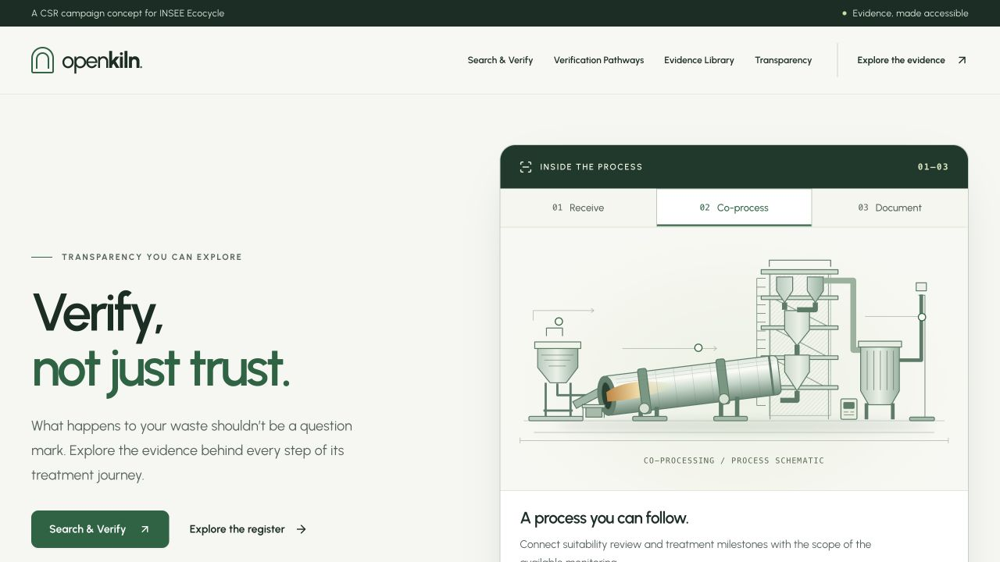
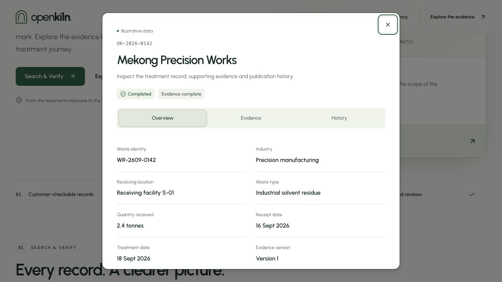
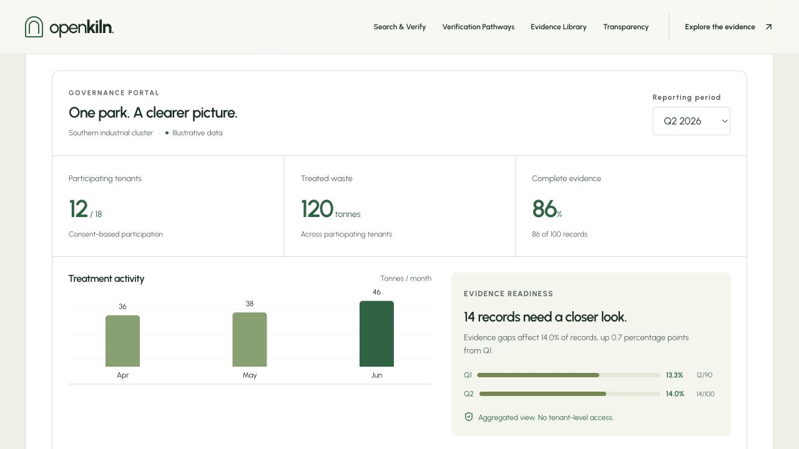

# Open Kiln

**Verify, not just trust.** An evidence-led CSR campaign concept for INSEE Ecocycle, built with Next.js and React.

Explore an operational evidence register, original public research and verification journeys for EHS teams and industrial park boards. The English interface distinguishes publisher-attributed research from illustrative operational records. This independently developed campaign concept is not an official INSEE customer portal.

[Explore the website](https://open-kiln.vercel.app) · [Browser review guide](docs/open-kiln-demo.md) · [Data provenance](docs/data-provenance.md)



<details>
<summary>Explore more screenshots</summary>

**Treatment record** — review the shipment, evidence availability and publication history in one place.



**Industrial park dashboard** — compare reporting periods, treated waste and evidence readiness across participating tenants.



</details>

Screenshots captured from the public website on 23 September 2026. Operational records and park figures are illustrative. Images are stored in `docs/images/` for GitHub documentation, outside the application's public assets.

## What you can explore

- Browse 24 operational examples across eight fictional organisations. Search by manifest ID, generator or treatment date; filter treatment/evidence status, sort and paginate.
- Read treatment details, monitoring coverage, limitations and publication revisions in accessible dialogs.
- Explore the receiving, co-processing and documentation stages in an interactive process schematic.
- Compare Q1/Q2 park reporting with reconciled treatment totals, evidence-gap rates and an actionable review queue.
- Search 16 library resources, including six external references from SINTEF, INSEE, EPA and GIZ. Open the ESG dashboard or prepare an evidence request directly from the library.
- Read historical Vietnam OPTOCE findings in their original scope, separately from the illustrative register.
- Prepare visit, roundtable, evidence, update and follow-up request summaries. Review is local; **no request is sent**. The official INSEE contact link is available for actual enquiries.

The public research is real and cited. Customer-level records, organisations, receiving facilities and park metrics are constructed examples; they never assert a real shipment or regulatory certification. There is no backend, authentication, live monitoring, booking, email delivery or export integration. Form entries remain in page memory and are discarded on close. See [data provenance](docs/data-provenance.md).

## Run locally

Recommended: **Node.js 24.21.0** from `.nvmrc` (supported range: **24.19.0 or newer within 24.x**), and [Corepack](https://github.com/nodejs/corepack). The exact Yarn version is pinned in `package.json`. Dependencies use the `node-modules` linker.

```sh
git clone https://github.com/Perceval-Wilhelm/open-kiln.git
cd open-kiln
nvm install
nvm use
corepack yarn install --immutable
corepack yarn dev
```

`.nvmrc` pins the verified Node release. If you use Homebrew instead of nvm, select its Node 24 installation in the current shell before running Yarn:

```sh
export PATH="$(brew --prefix node@24)/bin:$PATH"
node --version
```

This requires an existing `node@24` installation. `dev`, `build`, `start` and the combined checks fail early with a clear message when the selected runtime is unsupported. Node 26 is the newer Current line, but local development uses the latest verified Node 24 LTS patch. Vercel manages its own patch rollout and currently builds with 24.19.0; both patches are covered by validation. See the compatibility notes below.

Open [localhost:3000](http://localhost:3000). To use another port, run `corepack yarn dev --port 3001`.

For a production preview:

```sh
corepack yarn build
corepack yarn start
```

No environment variables or API keys are needed. Urbanist is served from the deployment through `next/font/local`; neither builds nor visitors need to request it from Google Fonts.

## Stack

| Area        | Choice                                                                                                         |
| ----------- | -------------------------------------------------------------------------------------------------------------- |
| Application | Next.js App Router, React, TypeScript                                                                          |
| Rendering   | Prerendered homepage with client components for interactions                                                   |
| Styling     | Tailwind CSS 4, project CSS and a local Urbanist variable font                                                 |
| UI controls | shadcn components composed from Radix primitives; Lucide icons                                                 |
| Forms       | React Hook Form with local validation                                                                          |
| Quality     | ESLint 10 with Next.js, React, Hooks and accessibility rules; Prettier; Vitest, Testing Library and Playwright |
| Deployment  | Vercel with the Next.js preset                                                                                 |

See [dependency versions and compatibility decisions](docs/toolchain.md). Vite remains a development dependency solely because Vitest uses it to transform tests; Next.js handles application development, routing and production builds.

## Repository map

```text
src/
  app/                     # Layout, metadata, homepage and 404
  components/ui/           # UI primitives used by the experience
  features/open-kiln/      # Campaign sections, client interactions, fixtures and tests
  lib/                     # Shared class-name utility
  styles/                  # Theme tokens and base styles
  test/                    # Vitest browser-environment setup
public/open-kiln.svg        # Project favicon
scripts/                   # Runtime guard and lint regression tests
e2e/                       # Production browser regression tests
.github/                   # Quality workflows and dependency updates
docs/                      # Guides, provenance, verification and README screenshots
```

Change operational examples in `treatment-records.ts`, editorial resources and governance snapshots in `data.ts`, public references in `references.ts`, campaign copy in `OpenKilnPage.tsx`, and styles in `open-kiln.css` / `experience.css`. These feature paths are relative to `src/features/open-kiln/`. `OpenKilnPage.tsx` composes static campaign content on the server. `Experience.tsx` owns client interaction state; `EvidenceOverlay.tsx` owns the accessible dialog shell, lazy content and loading/error recovery; `ExperienceSections.tsx` connects search, pathways and the library. Server-rendered content passes through the client provider as children. Keep static sections out of the client import graph when extending the page.

## Quality checks

```sh
corepack yarn format:check  # Check formatting without edits
corepack yarn lint          # Lint with zero warnings allowed
corepack yarn type-check    # Generate route types, then check TypeScript
corepack yarn test          # Run unit and interaction tests once
corepack yarn test:tooling  # Check lint coverage with intentional regressions
corepack yarn test:watch    # Watch tests during development
corepack yarn check:all     # Formatting, lint, types, unit/tooling tests and build
corepack yarn exec playwright install chromium  # Browser setup, once per Playwright update
corepack yarn test:e2e      # Browser tests against the existing production build
corepack yarn verify        # check:all followed by browser tests
```

`corepack yarn format` intentionally formats source and documentation. The `check` scripts never auto-fix files. GitHub Actions runs separate **Open Kiln quality** and **Open Kiln browser** checks for pull requests targeting `main` and pushes to `main`. The quality job also blocks high/critical dependency advisories. Browser tests start their own production server on port 4320; use `PLAYWRIGHT_PORT=4321 corepack yarn test:e2e` if that port is occupied. They do not reuse an existing server. Failure traces and screenshots are kept locally in ignored output folders and uploaded by CI for seven days.

See the [review guide](docs/open-kiln-demo.md) for manual checks and the [delivery guide](docs/deployment.md) for branch protection, dependency updates and deployment gates.

## Deploy on Vercel

The personal GitHub repository is connected to the Vercel project **open-kiln**. Its production domain is [open-kiln.vercel.app](https://open-kiln.vercel.app). Project settings use **Next.js**, repository root, Node.js **24.x**, and no legacy output or command overrides.

`vercel.json` declares the framework, immutable Corepack install and build command. It resets the output directory to the framework default. No application secrets or environment variables are needed. Preview deployments retain Vercel Authentication; the production domain is public.

Work on a feature branch, open a pull request, pass both required checks and review the Vercel preview before merging to `main`. A merge triggers a production deployment. Never redeploy the old Vite commit under the new Next.js preset. See [deployment setup, activation status and rollback](docs/deployment.md) when releasing a change.

## Documentation and references

- [Experience verification and closed findings](docs/verification-2026-09-23.md)
- [Data provenance and source register](docs/data-provenance.md)
- [GitHub and Vercel delivery guide](docs/deployment.md)
- [Dependency versions and compatibility](docs/toolchain.md)
- [Experience and browser review guide](docs/open-kiln-demo.md)
- [Original landing-page investigation](docs/open-kiln-landing-page-brief.md) — historical requirements context; the README and toolchain guide describe the current implementation.

External SINTEF, INSEE, EPA and GIZ publications retain their original dates and scope; they do not verify any illustrative treatment record. The kiln illustration and wordmark are rendered in code. Urbanist is distributed under the SIL Open Font License included with `@fontsource-variable/urbanist`.
